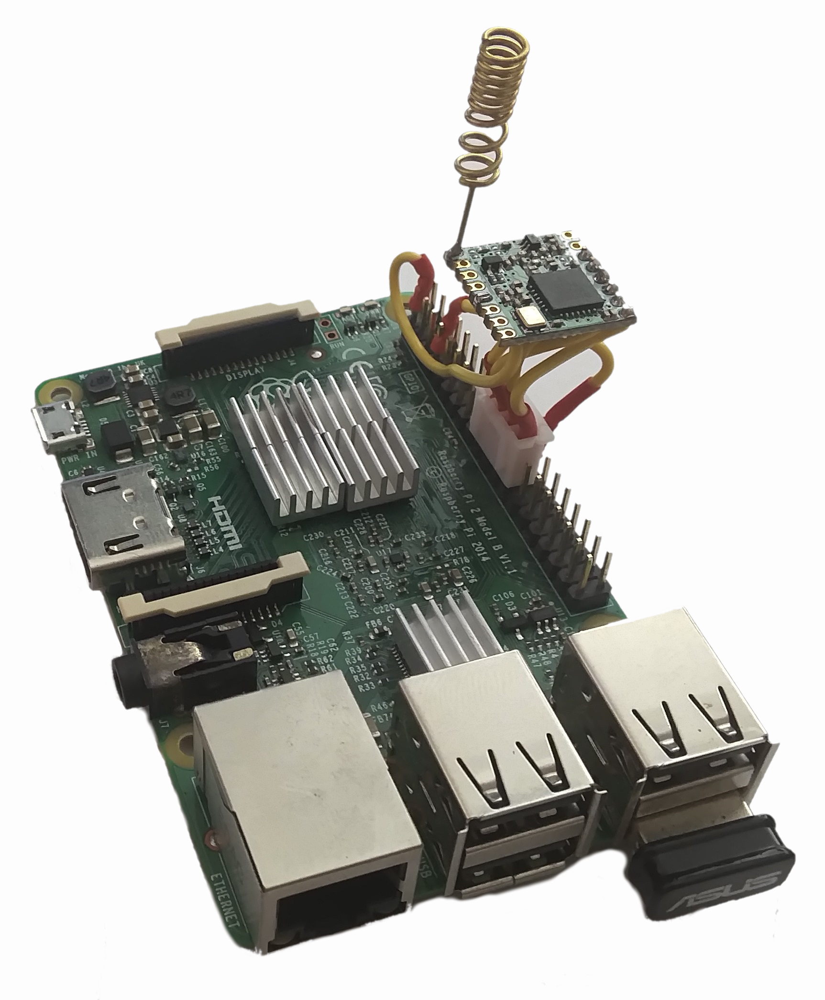

<div align="justify">


# WeCareLab LoRa implementation:

Before continuing with the implementation explained here it is recommended to first read the [basic concepts](https://github.com/wecarelab/LoRa/wiki/Basic-concepts)  needed to understand this project in the wiki.

# Hardware we're gonna need:

Although node-by-node connections can be made with LoRa, one of its most important features is that a single device can handle multiple nodes. For this you need a Gateway device, these devices have a very high price compared to the price of each of the nodes. Therefore, for these first experiments, a low cost gateway will be used using the same module as the nodes. This Gateway has many limitations since it can only work with one channel. Since these are the first tests with the LoRa technology it is more than enough, since with a single channel you can continue using multiple nodes.

## Gateway Hardware


The hardware of the gateway is composed of a Raspberry Pi 2 B(image below), a module RFM95W (right-hand image) and a WIFI USB device for mobility, although the latter is not strictly necessary as the RPI has an RJ45 cable connection.


**IMPORTANT:** Since no PCBs are used in this first approach to LoRa (to facilitate connections) be sure to **solder the antenna to the RFM95W first**. Many radio modules will stop working ( breaking down ) if they are switched on without the antenna. Therefore before connecting the RPI to the RFM95W make sure you have an antenna connected at all times.

The connections between the two devices must be made as follows:

```
      RPI            Radio module
   GND pin 25----------GND   (ground in)
   3V3 pin 17----------3.3V  (3.3V in)
 GPIO4 pin  7----------RST   (Reset)
CS/CE0 pin 24----------NSS   (CS chip select in)
   SCK pin 23----------SCK   (SPI clock in)
  MOSI pin 19----------MOSI  (SPI Data in)
  MISO pin 21----------MISO  (SPI Data out)
```

In the following picture you can see one of the many possibilities to physically connect the two components. Note that the orientation of the node antennas and the gateway antennas must have the same orientation. Therefore, depending on where the RPI is to be placed, the antenna must be oriented preferably upwards.

<div align="center">
  
</div>

## Node Hardware

In order to create a LoRa node in these examples, an Arduino Mini will be used together with the RFM95W module. The connections between these two are:

```
     Arduino Mini  Radio module
         GND----------GND   (ground in)
         3V3----------3.3V  (3.3V in)
  SS pin D10----------NSS   (CS chip select in)
 SCK pin D13----------SCK   (SPI clock in)
MOSI pin D11----------MOSI  (SPI Data in)
MISO pin D12----------MISO  (SPI Data out)
```

At the moment we will not add any sensor to simplify the examples as much as possible and focus on LoRa communication.

# Software we're gonna need:

This repository is oriented to recompile the maximum information from different sources and make easier the implementation of LoRa. For the gateway software is used the one provided by the non-lucrative organization  [WAZIUP](https://www.waziup.io). In the  [repository](https://github.com/CongducPham/LowCostLoRaGw) of this organization you can find more information about the multitude of options it offers. Although LoRa is designed to consume as little as possible, in this first example we will try to focus on communication. This implies that no energy saving techniques will be implemented in Arduino. Besides simplifying the examples this does not restrict the use of Arduino only as each microcontroller can use a different energy saving strategy.

## Gateway Software:

The Gateway software is based on a WAZIUP modified Raspbian Operating System [image](http://cpham.perso.univ-pau.fr/LORA/WAZIUP/raspberrypi-buster-WAZIUP-demo.iso.zip) that comes with a web configuration interface and a console mode interface.

The requirements are to use a minimum 8GB SD card and a class 10 card is highly recommended. If you use a card larger than 8GB, the partitions can be resized later in the Operating System using the [following instructions](https://www.raspberrypi.org/documentation/configuration/raspi-config.md).

In case of using Windows the steps to install the image in the RPI are:

* Download the OS image.
* Download balenaEtcher software from [balena.io](https://www.balena.io/etcher/).
* Run balenaEtcher and select te SD card drive.
* Finally click Burn to write the Raspberry Pi OS image to the SD card.

If you use another operating system or prefer another software instead of balenaEtcher you can find more information on the [RaspberryPi installation page](https://www.raspberrypi.org/documentation/installation/installing-images/).

The SD card image defines a pi user:

~~~
- login: pi
- password: loragateway
~~~

This image of the Raspberry Pi has a personalized WIFI management. If a separate USB WIFI is used as in this case it may not work well. The gateway can be used both as an access point and a WIFI client. At the first start of the RPI it will act as an access point so that the gateway can be directly accessed and configured via WEB. To simplify the example in this tutorial it is assumed that you have direct access to the RPI with a monitor, keyboard and mouse. All the necessary configurations will be done in a direct way. In the README of WAZIUP you will find more details to access the gateway, in the section ["Connect to you new gateway"](https://github.com/CongducPham/LowCostLoRaGw#connect-to-your-new-gateway).

Since the first login will be with user pi, the following menu will display:

~~~
=======================================* Gateway 0000B827EB982031 *===
0- sudo python start_gw.py                                           +
1- sudo ./lora_gateway --mode 1                                      +
2- sudo ./lora_gateway --mode 1 | python post_processing_gw.py       +
3- ps aux | grep -e start_gw -e lora_gateway -e post_proc -e log_gw  +
4- tail --line=25 ../Dropbox/LoRa-test/post-processing.log           +
5- tail --line=25 -f ../Dropbox/LoRa-test/post-processing.log        +
6- less ../Dropbox/LoRa-test/post-processing.log                     +
---------------------------------------------------* Connectivity *--+
f- test: ping 8.8.8.8                                                +
g- wifi: configure as WiFi client at next reboot                     +
h- wifi: indicate WiFi SSID and password at next reboot              +
i- wifi: configure as WiFi access point at next reboot               +
--------------------------------------------------* Filtering msg *--+
l- List LoRa reception indications                                   +
m- List radio module reset indications                               +
n- List boot indications                                             +
o- List post-processing status                                       +
p- List low-level gateway status                                     +
--------------------------------------------------* Configuration *--+
A- show gateway_conf.json                                            +
B- edit gateway_conf.json                                            +
C- show clouds.json                                                  +
D- edit clouds.json                                                  +
----------------------------------------------------------* ngrok *--+
M- get and install ngrok                                             +
N- ngrok authtoken                                                   +
O- ngrok tcp 22                                                      +
---------------------------------------------------------* Update *--+
U- update to latest version on repository                            +
V- download and install a file                                       +
W- run a command                                                     +
-----------------------------------------------------------* kill *--+
K- kill all gateway related processes                                +
R- reboot gateway                                                    +
S- shutdown gateway                                                  +
---------------------------------------------------------------------+
Q- quit                                                              +
======================================================================
Enter your choice:

~~~

To configure the gateway as a wifi client you can try using the "g" option in the menu. Then you have to configure the wifi network with "raspi-config" by accessing the "Network Options/N2 Wi-fi" menu. If it doesn't work you can see the  [manual WIFI configuration](#manual-wifi-configuration). To exit this menu and access all the OS options you have to enter Q and enter.

### Manual WIFI configuration:

As we will want to have access to the NET from the gateway we will configure the WIFI to act as a client. The first file to be configured is "/etc/network/interfaces", if we only have one WIFI device the file should look like below:

~~~
source-directory /etc/network/interfaces.d
auto wlan0
allow-hotplug wlan0
iface wlan0 inet static
wpa-conf /etc/wpa_supplicant/wpa_supplicant.conf
address 192.168.1.200
netmask 255.255.255.0
gateway 192.168.1.1
dns-nameservers 8.8.8.8 8.8.4.4
~~~

The next file to be configured is "/etc/wpa_supplicant/wpa_supplicant.conf", which indicates the country where we are and the different WIFI networks.

~~~
ctrl_interface=DIR=/var/run/wpa_supplicant GROUP=netdev
update_config=1
country=ES
network={
        ssid="SSID_Example1"
        psk=298414ec945cecadbc667044ac4092554e3684c8b97e84b5e012f3290d98c5
}
network={
        ssid="SSID_Example2"
        psk="XXXXXXXXXXX"
}
~~~

As you can see the network password can be set in 2 different ways. In plain text using quotes or directly the string psk (recommended). For the latter you can use "wpa_passphrase" : ***wpa_passphrase [ssid-name] [password-name]*** and copy to "/etc/wpa_supplicant/wpa_supplicant.conf".

Another aspect to consider if using a WIFI USB device is that it does not work well when restarting the RPI. This is a specific problem in this with my RPI and ASUS WIFI module. Maybe with another configuration you don't have this problem. A quick solution, while waiting to investigate the exact cause, is to turn the WLAN0 interface off and on again with. To make it automatic when starting the RPI you must indicate in the file "/etc/rc.local" the script to be executed. Simply add in the last line the path of the script, for example "/home/pi/restart_wifi" without quotes. The script to run:

~~~
#!/bin/bash
sudo ifdown wlan0
sleep 5
sudo ifup wlan0
~~~

Once we have a connection to the network with the RPI we access the administration web of the gateway with "http://[gateway-ip]/admin". The first page that loads is the basic configuration of the gateway.  At this point we can see in the following image if the RPI communicates with the RFM95W module, if the next message after "last rx" is in green it means that there is communication with the module.


It is important to update the software provided by WAZIUP before configuring anything. To do this, go to the "Gateway Update/Full Update" section.

To properly configure the gateway we access the "Gateway configuration/Radio" section. As explained in the basic concepts in the wiki the mode indicated here has to coincide with the one indicated later with the Arduino code. Looking at the table in the wiki the Spreading Factor must also match the chosen mode. The frequency is left as default and we make sure that the PA_BOOST is set to "true".

The next step is to configure the gateway to redirect the information to a MQTT broker. Access the "Clouds/Cloud MQTT" section and enable it by setting it to "true". Since the Raspian image comes with the mosquito package installed, the MQTT broker is already running. You have to indicate the ip of the gateway itself and configure the parameters "project name", "organization" and "sensor name". In "source list" we will indicate which sensors are allowed to use this MQTT Cloud.


 These will create the topic to which the sensor will send the data. If we configure the MQTT Cloud with the following data (same as in the image above):

~~~
project name:test
organization name:WeCareLab
sensor name:Sensor
source list :8
~~~

 The node with adrress 8 will create a topic "/test/WeCareLab/Sensor8". The advantage of MQTT is that we can subscribe to multiple sensors using the "#" character. For example with the topic "/test/WeCareLab/#" we will be subscribed to all the Sensors. As we will see later in the Arduino Code you can add another level to the topic's herarchy. Being able to separate multiple data sent by a node.


</div>
